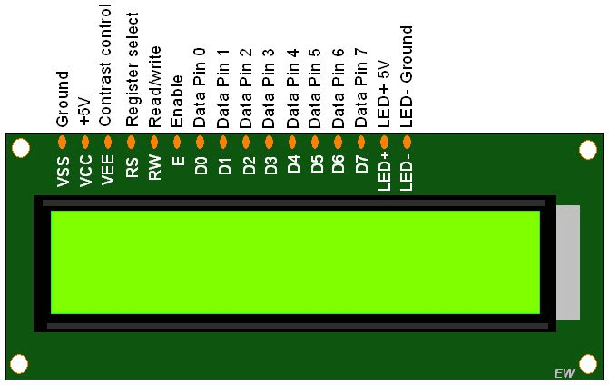

Conecciones según ejemplo de librería LiquidCrystal.h que viene con Arduino:
 * LCD RS pin al pin digital 12
 * LCD Enable pin al pin digital 11
 * LCD D4 pin al pin digital 5
 * LCD D5 pin al pin digital 4
 * LCD D6 pin al pin digital 3
 * LCD D7 pin al pin digital 2
 * LCD R/W pin a GND
 * LCD VSS pin a GND
 * LCD VCC pin a 5V
 * 10K potenciometro:
 * Los extremos a +5V y GND
 * El pin central al LCD pin VO (pin 3)
 
 
 
 VO = VEE = Contrast Control
 
 
 
